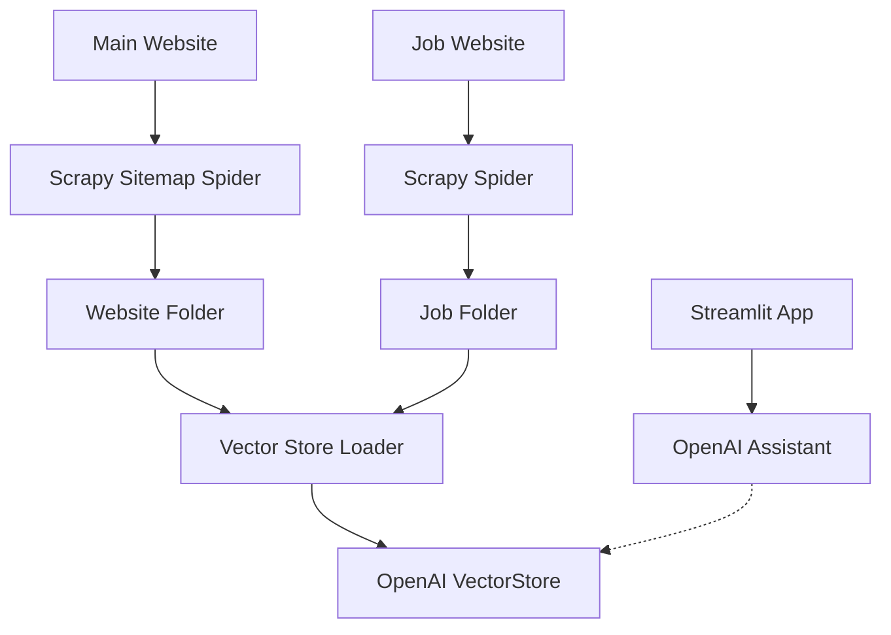

# Project Overview

## Tree Structure
```
.
├── app.py  # streamlit app
├── assitant.py  # openai assistant
├── config.py
├── open_ai_delete_vector_stores_and_files.py  # deletes all vector stores
├── open_ai_vector_store_loader.py  # loads all vector stores
├── README.md
├── requirements.txt
└── scraper
    ├── data
    │   ├── website  # all website data
    │   └── jobs  # all job data
    ├── scraper
    │   ├── settings.py
    │   └── spiders
    │       ├── arcelormittal-jobs.py  # crawls jobs
    │       └── arcelormittal-website.py  # crawls website
    ├── scrapy.cfg
    └── utils.py  # scrapy utils
```
# Setup
Set `OPENAI_API_KEY=sk-...` to your Openai key as an environment variable.
```bash
# Install requirements
pip install -r requirements.txt

# Scrape data
cd scraper
scrapy crawl arcelormittal-website
scrapy crawl arcelormittal-jobs

# Load scraped Data in OpenAI Vector Store
cd ..
python open_ai_vector_store_loader.py

# Run streamlit app
streamlit run app.py
```
