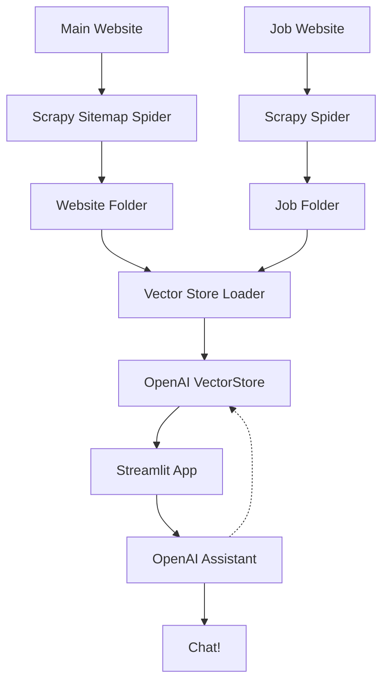

```mermaid
graph TD;
    A[Main Website] --> B[Scrapy Sitemap Spider];
    A2[Job Website] --> B2[Scrapy Spider];
    B --> C[Website Folder];
    B2 --> C2[Job Folder];
    C --> D[Vector Store Loader];
    C2 --> D;
    D --> E[OpenAI VectorStore];
    E --> F[Streamlit App];
    F --> G[OpenAI Assistant];
    G -.-> E;
    G --> H[Chat!];
```